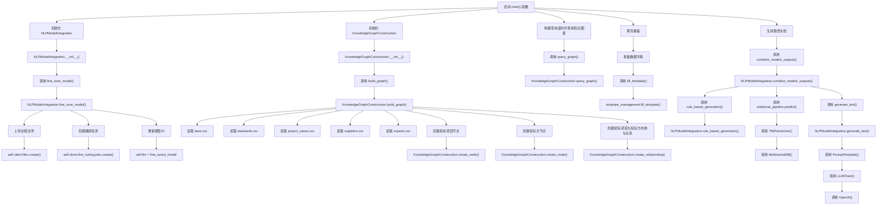

# bidding_document_generator
### 项目结构
```
bidding_document_generator/
│
├── data/
│   ├── laws.csv
│   ├── standards.csv
│   ├── project_cases.csv
│   ├── suppliers.csv
│   ├── experts.csv
│   └── bidding_data.csv
│
├── templates/
│   ├── bidding_template.json
│   ├── evaluation_report_template.json
│   ├── answer_letter_template.json
│   ├── winning_notice_template.json
│   └──...
│
├── src/
│   ├── __init__.py
│   ├── nlp_model_integration.py
│   ├── knowledge_graph_construction.py
│   ├── template_management.py
│   └── main.py
│
├── requirements.txt
└── README.md
```

### 说明
- **data 目录**：
    - 存储所有与招投标相关的数据文件，包括但不限于法律法规、行业标准、项目案例、供应商信息、专家库以及用于微调的数据文件。测试

- **templates 目录**：
    - 包含各种招投标文件的模板，如招标文件、评标报告、答疑函件、中标通知书等的模板文件。模板使用JSON格式存储，其中包含占位符，方便后续填充。

- **src 目录**：
    - 包含项目中的所有代码实现，包括文件处理，自然语言处理，知识图谱和模型的管理和自动填充
    - `__init__.py`：使 `src` 目录成为一个 Python 包。
    - `multi_threaded_file_preprocessor.py`：负责实现多线程处理大批量文件，包括格式识别、解析以及预处理。
    - `nlp_model_integration.py`：负责自然语言处理模型的集成、微调及多模型融合。
    - `knowledge_graph_construction.py`：实现知识图谱的构建和查询。
    - `template_management.py`：处理模板的管理和自动化填充。
    - `main.py`：作为项目的主入口，协调不同模块的调用，完成最终文件的生成。

- **requirements.txt**：
    - 列出项目所需的所有 Python 依赖。

- **README.md**：
    - 提供项目的说明，包括如何安装、运行项目，以及每个模块的功能概述。

### 代码执行流程



### 代码解释

### `template_management.py`
| 方法名 | 功能 | 输入 | 输出 | 处理逻辑 |
|--------|------|------|------|----------|
| `fill_template` | 填充模板文件 | `template_path`: 模板文件路径；`data`: 数据字典 | 填充后的模板字符串 | 使用 Jinja2 的 `Template` 类读取模板文件内容，并通过 `render` 方法将数据字典中的值填充到模板中。 |

---

### `multi_threaded_file_preprocessor.py`
| 方法名 | 功能 | 输入 | 输出 | 处理逻辑 |
|--------|------|------|------|----------|
| `parse_pdf` | 解析 PDF 文件并提取文本 | `file_path`: PDF 文件路径 | 提取的文本字符串 | 使用 PyPDF2 提取 PDF 文本内容，使用 Tabula 提取表格内容，并将两者合并为一个字符串。 |
| `parse_docx` | 解析 DOCX 文件并提取文本 | `file_path`: DOCX 文件路径 | 提取的文本字符串 | 使用 python-docx 遍历文档段落，将所有段落文本拼接成一个字符串。 |
| `parse_excel` | 解析 Excel 文件并提取文本 | `file_path`: Excel 文件路径 | 提取的文本字符串 | 使用 pandas 读取 Excel 文件，将每一行的每个单元格内容拼接成一个字符串。 |
| `parse_html` | 解析 HTML 文件并提取文本 | `file_path`: HTML 文件路径 | 提取的文本字符串 | 使用 BeautifulSoup 解析 HTML 文件，提取纯文本内容。 |
| `parse_txt` | 解析 TXT 文件并提取文本 | `file_path`: TXT 文件路径 | 提取的文本字符串 | 直接读取 TXT 文件内容。 |
| `clean_text` | 清洗文本 | `text`: 输入文本 | 清洗后的文本字符串 | 移除 HTML 标签和特殊字符。 |
| `remove_stopwords` | 移除停用词 | `text`: 输入文本 | 移除停用词后的文本字符串 | 使用 NLTK 的停用词列表过滤掉英文停用词。 |
| `standardize_text` | 标准化文本 | `text`: 输入文本 | 标准化后的文本字符串 | 将文本转换为小写。 |
| `process_file` | 处理单个文件 | `file_path`: 文件路径 | 处理后的文本字符串 | 根据文件类型调用相应的解析函数，然后依次进行文本清洗、移除停用词和标准化处理。 |
| `process_files_in_directory` | 批量处理目录下的文件 | `directory`: 目录路径 | 所有文件处理后的文本列表 | 使用多线程并发处理目录下的所有文件，返回每个文件处理后的文本列表。 |

---

### `entity_recognition_and_relation_extraction.py`
| 方法名 | 功能 | 输入 | 输出 | 处理逻辑 |
|--------|------|------|------|----------|
| `rule_based_entity_recognition` | 基于规则的实体识别 | `text`: 输入文本 | 包含识别到的实体的字典 | 使用正则表达式匹配特定格式的实体（如项目编号、金额等）。 |
| `ml_based_entity_recognition` | 基于机器学习的实体识别 | `text`: 输入文本 | 包含识别到的实体的字典 | 使用 CRF 模型进行实体识别（示例中返回固定结果）。 |
| `bert_based_entity_recognition` | 基于预训练语言模型的实体识别 | `text`: 输入文本 | 包含识别到的实体的字典 | 使用 Hugging Face 的 pipeline 调用 BERT 模型进行命名实体识别。 |
| `dependency_parsing_relation_extraction` | 基于依存句法分析的关系抽取 | `text`: 输入文本 | 包含关系三元组的列表 | 简单示例：检查文本中是否包含特定关键词，生成关系三元组。 |
| `deep_learning_relation_extraction` | 基于深度学习的关系抽取 | `text`: 输入文本 | 包含关系三元组的列表 | 简单示例：检查文本中是否包含特定关键词，生成关系三元组。 |
| `process_text` | 处理单个文本的实体和关系抽取 | `text`: 输入文本 | None | 调用上述方法进行实体识别和关系抽取，并将结果存储到 Neo4j 图数据库中。 |
| `process_batch_text_files` | 批量处理文本文件 | `file_paths`: 文件路径列表 | None | 遍历文件路径列表，逐个读取文件内容并调用 `process_text` 方法进行处理。 |

---

### `knowledge_graph_construction.py`
| 方法名 | 功能 | 输入 | 输出 | 处理逻辑 |
|--------|------|------|------|----------|
| `__init__` | 初始化知识图谱构建类 | `uri`: 数据库 URI；`user`: 用户名；`password`: 密码 | None | 创建 Neo4j 数据库连接。 |
| `create_node` | 创建节点 | `label`: 节点标签；`properties`: 节点属性字典 | None | 使用 Cypher 查询在 Neo4j 中创建节点。 |
| `create_relationship` | 创建关系 | `node1_label`: 起始节点标签；`node1_id`: 起始节点 ID；`rel_type`: 关系类型；`node2_label`: 目标节点标签；`node2_id`: 目标节点 ID | None | 使用 Cypher 查询在 Neo4j 中创建两个节点之间的关系。 |
| `build_graph` | 构建知识图谱 | None | None | 从 CSV 文件中读取数据，创建招标项目、投标方等节点及它们之间的关系。 |
| `query_graph` | 查询知识图谱 | `query`: Cypher 查询语句 | 查询结果列表 | 使用 Cypher 查询从 Neo4j 中获取数据，并返回查询结果。 |

---

### `nlp_model_integration.py`
| 方法名 | 功能 | 输入 | 输出 | 处理逻辑 |
|--------|------|------|------|----------|
| `__init__` | 初始化 NLP 模型集成类 | `api_key`: OpenAI API 密钥 | None | 设置 OpenAI API 密钥，并初始化 LLM 和统计学管道模型。 |
| `rule_based_generation` | 基于规则的文本生成 | `clause_type`: 条款类型 | 生成的文本字符串 | 根据条款类型返回固定的文本内容。 |
| `generate_text` | 基于 LLM 的文本生成 | `input_text`: 输入文本 | 生成的文本字符串 | 使用 LangChain 的 LLMChain 调用 OpenAI 模型生成文本。 |
| `fine_tune_model` | 微调模型 | `training_data_path`: 训练数据文件路径 | None | 上传训练数据文件，创建微调任务，并更新微调后的模型 ID。 |
| `combine_models_outputs` | 融合多个模型的输出 | `input_text`: 输入文本 | 融合后的文本字符串 | 分别调用基于规则、统计学管道和微调后的 LLM 模型生成文本，并将结果简单拼接。 |

---

### `main.py`
| 方法名 | 功能 | 输入 | 输出 | 处理逻辑 |
|--------|------|------|------|----------|
| `main` | 主程序入口 | None | 最终生成的文档字符串 | 初始化 NLP 模型集成和知识图谱构建类，微调模型，构建知识图谱，查询相关技术标准，填充模板，融合模型输出生成最终文档。 |

### 运行项目
1. 确保 `neo4j` 数据库已启动并配置好用户名和密码。
2. 安装所需的依赖：
    ```bash
    pip install -r requirements.txt
    ```
3. 运行项目：
    ```bash
    python src/main.py
    ```