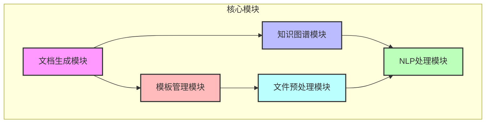
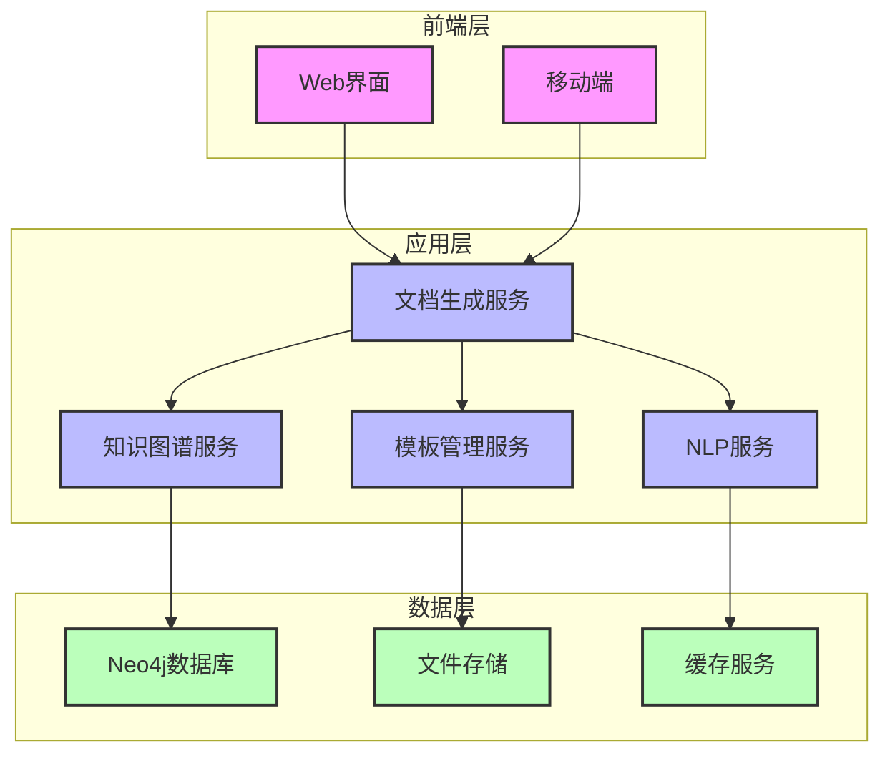
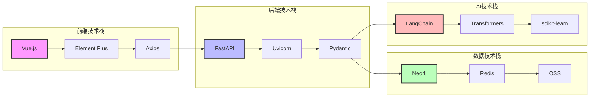
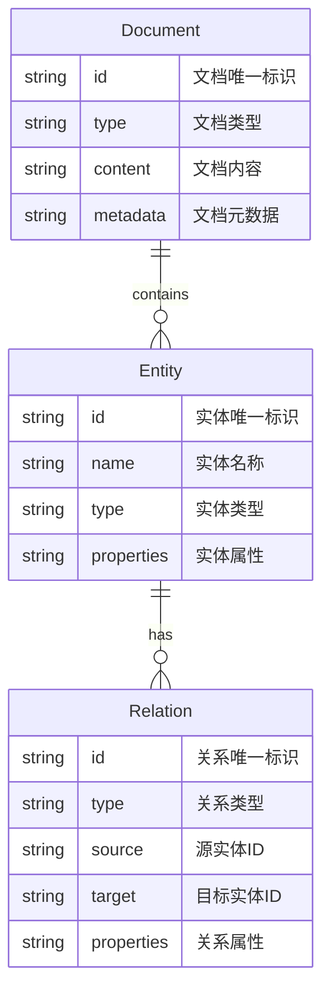
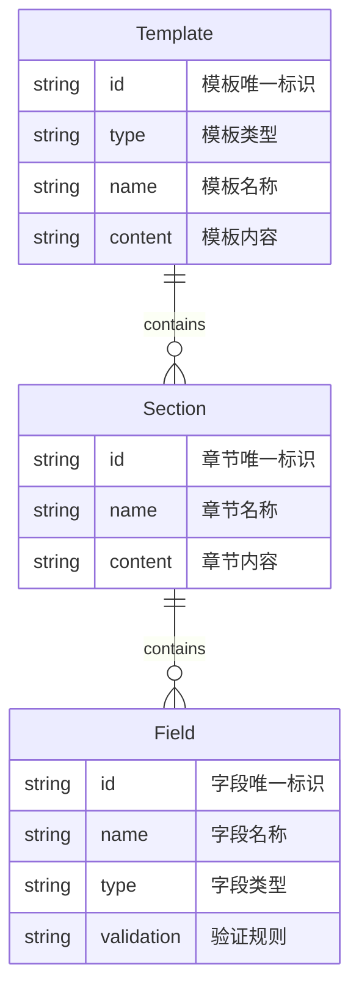
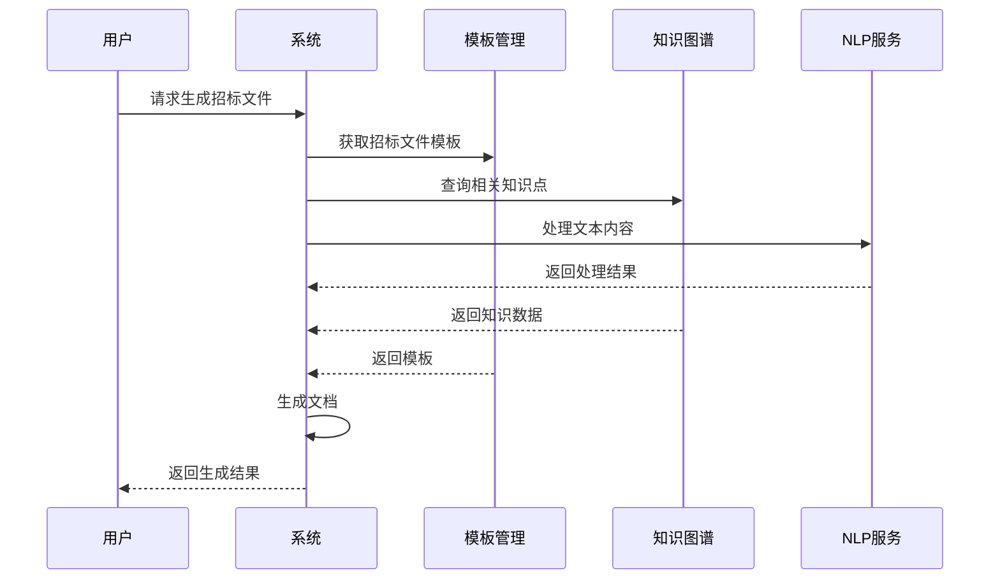
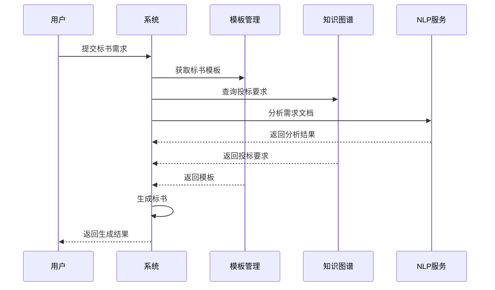
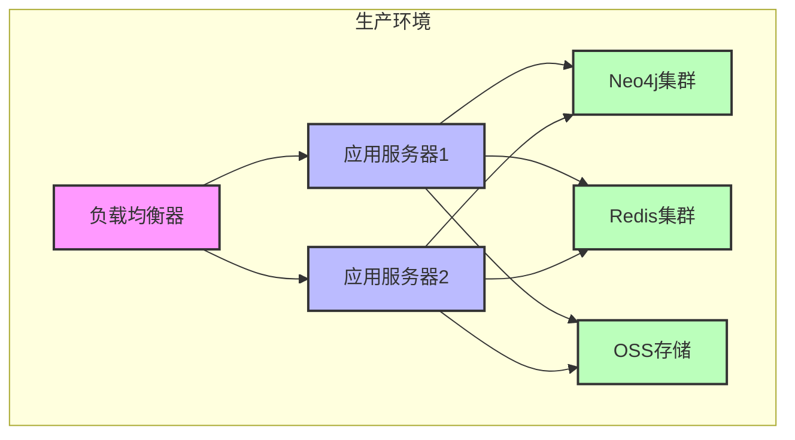

# 招标文件生成系统技术方案

## 1. 系统介绍

### 1.1 系统概述
本系统是一个基于Python和Neo4j的智能招标文件生成系统，旨在通过人工智能和知识图谱技术，实现招标文件、标书、专家评标报告、答疑函件、中标通知书等文档的自动化生成。系统集成了自然语言处理、知识图谱、模板管理等技术，提供高效、准确的文档生成服务。

### 1.2 主要功能

#### 招标文件自动生成
系统能够根据项目需求自动生成标准化的招标文件，包括招标公告、招标文件、技术规范等。通过知识图谱技术，确保生成的文件符合相关法律法规和行业标准。

#### 标书智能生成
基于招标文件要求，系统可以智能生成投标文件，包括技术方案、商务方案、资质证明等。系统会自动检查标书的完整性和合规性，确保满足招标要求。

#### 专家评标报告生成
系统能够根据评标专家的评分和意见，自动生成规范的评标报告。通过NLP技术分析专家意见，提取关键信息，生成结构化的评标结论。

#### 答疑函件生成
针对投标人的疑问，系统可以自动生成规范的答疑函件。通过知识图谱技术，确保答疑内容准确、完整，并符合相关规范。

#### 中标通知书生成
根据评标结果，系统自动生成中标通知书，包含中标单位信息、中标金额、合同签订要求等关键信息。

#### 知识图谱构建与管理
系统通过NLP技术从历史文档中提取实体和关系，构建招标领域的知识图谱。支持知识图谱的动态更新和维护，确保知识的时效性。

#### 模板管理与维护
提供可视化的模板管理界面，支持模板的创建、修改、版本控制等功能。系统内置多种标准模板，并支持自定义模板。

#### 文档预处理与解析
支持多种格式文档的导入和解析，包括Word、PDF、Excel等。通过OCR技术处理扫描文档，提取结构化信息。

## 2. 功能模块介绍

### 2.1 核心模块

#### 模块概览
| 模块名称 | 主要功能 | 技术实现 | 依赖服务 |
|---------|---------|---------|---------|
| 文档生成模块 | 基于模板生成各类文档 | Jinja2模板引擎 | 模板管理服务 |
| 知识图谱模块 | 构建和管理知识图谱 | Neo4j图数据库 | NLP服务 |
| NLP处理模块 | 文本分析和处理 | 阿里云NLP服务 | 知识图谱服务 |
| 模板管理模块 | 模板的CRUD操作 | FastAPI | 文件存储服务 |
| 文件预处理模块 | 文档格式转换和解析 | python-docx, PyPDF2 | 文件存储服务 |

#### 模块关系图


#### 模块详细说明

##### 文档生成模块
文档生成模块是系统的核心组件，负责各类文档的自动生成。该模块基于模板引擎，结合知识图谱和NLP技术，实现文档的智能生成。

##### 知识图谱模块
知识图谱模块负责构建和管理招标领域的知识网络。通过实体识别和关系抽取，将非结构化数据转化为结构化的知识图谱。

##### NLP处理模块
NLP处理模块提供文本分析能力，包括实体识别、关系抽取、文本分类等功能。该模块采用阿里云NLP服务，确保处理效果。

##### 模板管理模块
模板管理模块负责模板的存储、解析和更新。支持模板的版本控制，确保模板的规范性和可维护性。

##### 文件预处理模块
文件预处理模块负责文档的格式转换和内容提取。支持多种文档格式，确保数据的准确性和完整性。

## 3. 业务架构

### 3.1 系统架构图


### 3.2 技术架构

#### 整体架构
系统采用分层架构设计，包括前端层、应用层和数据层。前端层提供用户界面，应用层处理业务逻辑，数据层负责数据存储和管理。

#### 技术选型
| 层级 | 技术选型 | 说明 |
|------|---------|------|
| 前端层 | Vue.js 3.0 | 构建响应式用户界面 |
| 应用层 | Python FastAPI | 提供高性能API服务 |
| 数据层 | Neo4j 5.18.0 | 图数据库，存储知识图谱 |
| 存储层 | 阿里云OSS | 对象存储服务 |
| AI服务 | 阿里云NLP | 提供NLP能力 |

#### 技术架构图


## 4. 数据模型

### 4.1 知识图谱模型

#### 实体关系图


#### 字段说明表
| 实体/关系 | 字段名 | 类型 | 业务含义 | 示例值 |
|-----------|--------|------|----------|--------|
| Entity | id | string | 实体唯一标识 | "E001" |
| Entity | name | string | 实体名称 | "招标项目" |
| Entity | type | string | 实体类型 | "Project" |
| Entity | properties | string | 实体属性 | {"budget": "100万"} |
| Relation | id | string | 关系唯一标识 | "R001" |
| Relation | type | string | 关系类型 | "BELONGS_TO" |
| Relation | source | string | 源实体ID | "E001" |
| Relation | target | string | 目标实体ID | "E002" |
| Document | id | string | 文档唯一标识 | "D001" |
| Document | type | string | 文档类型 | "Bidding" |
| Document | content | string | 文档内容 | "招标文件正文" |
| Document | metadata | string | 文档元数据 | {"createTime": "2024-03-20"} |

### 4.2 模板模型

#### 模板结构图


#### 字段说明表
| 实体 | 字段名 | 类型 | 业务含义 | 示例值 |
|------|--------|------|----------|--------|
| Template | id | string | 模板唯一标识 | "T001" |
| Template | type | string | 模板类型 | "Bidding" |
| Template | name | string | 模板名称 | "标准招标文件模板" |
| Template | content | string | 模板内容 | "模板正文" |
| Section | id | string | 章节唯一标识 | "S001" |
| Section | name | string | 章节名称 | "项目概况" |
| Section | content | string | 章节内容 | "章节正文" |
| Field | id | string | 字段唯一标识 | "F001" |
| Field | name | string | 字段名称 | "项目名称" |
| Field | type | string | 字段类型 | "String" |
| Field | validation | string | 验证规则 | "required" |

## 5. 业务流程

### 5.1 招标文件生成流程


### 5.2 标书生成流程


## 6. 技术选型

### 6.1 核心技术

#### 技术栈概览
| 类别 | 技术 | 版本 | 用途 | 说明 |
|------|------|------|------|------|
| 编程语言 | Python | 3.8+ | 后端开发 | 主要开发语言 |
| 数据库 | Neo4j | 5.18.0 | 图数据库 | 存储知识图谱 |
| AI框架 | LangChain | 0.3.23 | AI应用开发 | 构建AI应用 |
| AI框架 | Transformers | 4.51.2 | 模型加载 | 加载预训练模型 |
| AI框架 | scikit-learn | 1.6.1 | 机器学习 | 模型训练和评估 |
| 文档处理 | python-docx | 1.1.2 | Word文档处理 | 生成Word文档 |
| 文档处理 | PyPDF2 | 3.0.1 | PDF文档处理 | 处理PDF文档 |
| 文档处理 | tabula-py | 2.10.0 | 表格提取 | 从PDF提取表格 |
| NLP服务 | 阿里云NLP | 最新版 | 自然语言处理 | 提供NLP能力 |
| NLP工具 | NLTK | 3.9.1 | 文本处理 | 基础文本处理 |
| NLP工具 | CRF Suite | 0.5.0 | 序列标注 | 实体识别 |

### 6.2 开发工具
| 工具 | 版本 | 用途 | 说明 |
|------|------|------|------|
| Git | 2.x | 版本控制 | 代码版本管理 |
| Docker | 24.x | 容器化 | 应用容器化部署 |
| pip | 23.x | 依赖管理 | Python包管理 |
| python-dotenv | 1.0.0 | 环境管理 | 环境变量管理 |

## 7. 接口文档

### 7.1 统一请求结构
```json
{
    "code": 200,
    "message": "success",
    "data": {
        // 具体业务数据
    }
}
```

### 7.2 统一响应结构
```json
{
    "code": 200,
    "message": "success",
    "data": {
        // 具体业务数据
    }
}
```

### 7.3 文档生成接口

#### 生成招标文件
- **接口说明**：根据项目信息生成招标文件
- **请求路径**：`POST /api/v1/documents/bidding`
- **请求参数**：
```json
{
    "template_id": "string", // 模板ID，必填
    "project_info": {
        "name": "string", // 项目名称，必填
        "type": "string", // 项目类型，必填
        "requirements": "string" // 项目要求，必填
    },
    "parameters": {
        "key": "value" // 其他参数，选填
    }
}
```
- **响应参数**：
```json
{
    "code": 200,
    "message": "success",
    "data": {
        "document_id": "string", // 生成的文档ID
        "document_url": "string", // 文档下载地址
        "create_time": "string" // 创建时间
    }
}
```

#### 生成标书
- **接口说明**：根据招标文件生成标书
- **请求路径**：`POST /api/v1/documents/proposal`
- **请求参数**：
```json
{
    "template_id": "string", // 模板ID，必填
    "bidder_info": {
        "name": "string", // 投标人名称，必填
        "qualification": "string" // 资质信息，必填
    },
    "project_id": "string", // 项目ID，必填
    "parameters": {
        "key": "value" // 其他参数，选填
    }
}
```
- **响应参数**：
```json
{
    "code": 200,
    "message": "success",
    "data": {
        "document_id": "string", // 生成的文档ID
        "document_url": "string", // 文档下载地址
        "create_time": "string" // 创建时间
    }
}
```

### 7.4 知识图谱接口

#### 查询实体
- **接口说明**：根据实体ID查询实体信息
- **请求路径**：`GET /api/v1/knowledge/entity/{entity_id}`
- **请求参数**：
  - entity_id: 实体ID，路径参数
- **响应参数**：
```json
{
    "code": 200,
    "message": "success",
    "data": {
        "id": "string", // 实体ID
        "name": "string", // 实体名称
        "type": "string", // 实体类型
        "properties": {} // 实体属性
    }
}
```

#### 添加关系
- **接口说明**：添加实体间的关系
- **请求路径**：`POST /api/v1/knowledge/relation`
- **请求参数**：
```json
{
    "source_id": "string", // 源实体ID，必填
    "target_id": "string", // 目标实体ID，必填
    "relation_type": "string", // 关系类型，必填
    "properties": {
        "key": "value" // 关系属性，选填
    }
}
```
- **响应参数**：
```json
{
    "code": 200,
    "message": "success",
    "data": {
        "relation_id": "string", // 关系ID
        "create_time": "string" // 创建时间
    }
}
```

### 7.5 模板管理接口

#### 获取模板
- **接口说明**：根据模板ID获取模板信息
- **请求路径**：`GET /api/v1/templates/{template_id}`
- **请求参数**：
  - template_id: 模板ID，路径参数
- **响应参数**：
```json
{
    "code": 200,
    "message": "success",
    "data": {
        "id": "string", // 模板ID
        "name": "string", // 模板名称
        "content": "string", // 模板内容
        "sections": [] // 模板章节
    }
}
```

#### 更新模板
- **接口说明**：更新模板信息
- **请求路径**：`PUT /api/v1/templates/{template_id}`
- **请求参数**：
```json
{
    "name": "string", // 模板名称，必填
    "content": "string", // 模板内容，必填
    "sections": [
        {
            "name": "string", // 章节名称，必填
            "content": "string" // 章节内容，必填
        }
    ]
}
```
- **响应参数**：
```json
{
    "code": 200,
    "message": "success",
    "data": {
        "template_id": "string", // 模板ID
        "update_time": "string" // 更新时间
    }
}
```

## 8. 部署方案

### 8.1 环境要求
| 类别 | 要求 | 说明 |
|------|------|------|
| 操作系统 | Linux/Windows | 支持主流操作系统 |
| Python版本 | 3.8+ | 需要Python 3.8或更高版本 |
| 数据库 | Neo4j 5.18.0 | 需要Neo4j图数据库 |
| 容器化 | Docker 24.x | 需要Docker环境 |
| 云服务 | 阿里云账号 | 用于NLP服务和对象存储 |

### 8.2 部署架构


### 8.3 部署步骤
1. **环境准备**
   - 安装Docker和Docker Compose
   - 配置Neo4j数据库
   - 配置阿里云服务

2. **应用部署**
   - 构建Docker镜像
   - 配置环境变量
   - 启动应用服务

3. **服务配置**
   - 配置负载均衡
   - 配置数据库连接
   - 配置缓存服务

4. **监控配置**
   - 配置日志收集
   - 配置性能监控
   - 配置告警规则

