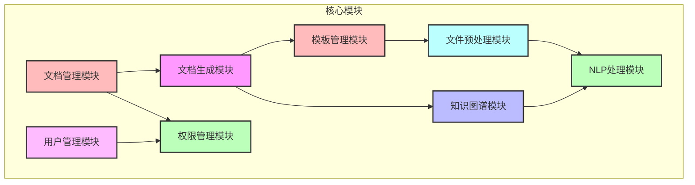
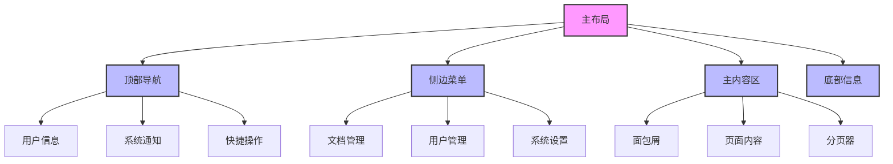

# 招标文件生成系统技术方案

[前面内容保持不变，在2.1核心模块部分添加新的模块]

### 2.1 核心模块

#### 模块概览
| 模块名称 | 主要功能 | 技术实现 | 依赖服务 |
|---------|---------|---------|---------|
| 文档生成模块 | 基于模板生成各类文档 | Jinja2模板引擎 | 模板管理服务 |
| 知识图谱模块 | 构建和管理知识图谱 | Neo4j图数据库 | NLP服务 |
| NLP处理模块 | 文本分析和处理 | 阿里云NLP服务 | 知识图谱服务 |
| 模板管理模块 | 模板的CRUD操作 | FastAPI | 文件存储服务 |
| 文件预处理模块 | 文档格式转换和解析 | python-docx, PyPDF2 | 文件存储服务 |
| 用户管理模块 | 用户注册、登录、管理 | FastAPI + JWT | Redis |
| 权限管理模块 | 角色权限控制 | RBAC模型 | Redis |
| 文档管理模块 | 文档CRUD和预览 | FastAPI | 文件存储服务 |

#### 模块关系图


#### 模块详细说明

[原有模块说明保持不变，添加新模块说明]

##### 用户管理模块
用户管理模块负责系统的用户管理功能，包括用户注册、登录、信息管理等。支持个人用户和管理员用户两种角色，实现用户信息的CRUD操作。

##### 权限管理模块
权限管理模块基于RBAC（基于角色的访问控制）模型，实现细粒度的权限控制。支持角色的创建、修改、删除，以及权限的分配和回收。

##### 文档管理模块
文档管理模块提供各类文档的管理功能，包括标书、专家评估报告、答疑函件、中标通知书的CRUD操作和在线预览功能。

### 2.2 用户角色与权限

#### 角色定义
| 角色 | 描述 | 权限范围 |
|------|------|----------|
| 超级管理员 | 系统最高权限 | 所有权限 |
| 管理员 | 系统管理权限 | 用户管理、权限分配、系统配置 |
| 普通用户 | 基础使用权限 | 文档操作、个人信息管理 |

#### 权限矩阵
| 功能模块 | 超级管理员 | 管理员 | 普通用户 |
|----------|------------|--------|----------|
| 用户管理 | 完全控制 | 查看、编辑 | 查看个人信息 |
| 权限管理 | 完全控制 | 查看、分配 | 无权限 |
| 文档管理 | 完全控制 | 完全控制 | 个人文档管理 |
| 系统配置 | 完全控制 | 查看 | 无权限 |

### 2.3 文档管理功能

#### 标书管理
- 列表查询：支持多条件筛选、排序、分页
- 文档预览：支持在线预览、下载
- CRUD操作：创建、读取、更新、删除标书
- 版本控制：支持文档版本管理
- 状态管理：草稿、待审核、已发布等状态

#### 专家评估报告
- 列表查询：按项目、专家、时间等条件查询
- 报告预览：支持在线预览、导出PDF
- CRUD操作：创建、编辑、删除报告
- 评分管理：支持多维度评分
- 意见管理：专家意见收集和整理

#### 答疑函件
- 列表查询：按项目、时间、状态查询
- 函件预览：支持在线预览、打印
- CRUD操作：创建、回复、归档函件
- 流程管理：支持函件处理流程
- 通知管理：自动通知相关方

#### 中标通知书
- 列表查询：按项目、中标单位查询
- 通知书预览：支持在线预览、打印
- CRUD操作：创建、编辑、发送通知书
- 模板管理：支持多种通知书模板
- 发送管理：支持邮件、短信通知

## 3. 前端设计

### 3.1 技术栈选型
| 类别 | 技术 | 版本 | 说明 |
|------|------|------|------|
| 前端框架 | Vue.js | 3.3.0 | 核心框架 |
| 构建工具 | Vite | 4.5.0 | 开发构建工具 |
| UI框架 | Element Plus | 2.4.0 | 组件库 |
| 状态管理 | Pinia | 2.1.0 | 状态管理 |
| 路由管理 | Vue Router | 4.2.0 | 路由管理 |
| HTTP客户端 | Axios | 1.6.0 | 网络请求 |
| 工具库 | Lodash | 4.17.21 | 工具函数库 |
| 图表库 | ECharts | 5.4.0 | 数据可视化 |
| 富文本编辑器 | TinyMCE | 6.7.0 | 文档编辑 |
| PDF预览 | PDF.js | 3.11.0 | PDF在线预览 |

### 3.2 项目结构
```
src/
├── api/                # API接口
├── assets/            # 静态资源
├── components/        # 公共组件
├── composables/       # 组合式函数
├── layouts/           # 布局组件
├── router/            # 路由配置
├── stores/            # 状态管理
├── styles/            # 样式文件
├── utils/             # 工具函数
└── views/             # 页面组件
```

### 3.3 页面设计

#### 布局设计


#### 主要页面
1. **登录页面**
   - 账号密码登录
   - 验证码校验
   - 记住密码功能

2. **首页仪表盘**
   - 数据统计概览
   - 待办事项
   - 最近文档
   - 系统公告

3. **文档管理页面**
   - 文档列表
   - 高级搜索
   - 批量操作
   - 文档预览

4. **用户管理页面**
   - 用户列表
   - 角色管理
   - 权限配置
   - 操作日志

5. **系统设置页面**
   - 基础配置
   - 模板管理
   - 系统日志
   - 数据备份

### 3.4 组件设计

#### 公共组件
| 组件名称 | 功能描述 | 使用场景 |
|----------|----------|----------|
| SearchForm | 高级搜索表单 | 列表页面搜索 |
| DataTable | 数据表格 | 数据列表展示 |
| FileUpload | 文件上传 | 文档上传 |
| RichEditor | 富文本编辑器 | 文档编辑 |
| PDFViewer | PDF预览 | 文档预览 |
| StatusTag | 状态标签 | 状态展示 |
| ConfirmDialog | 确认对话框 | 操作确认 |

#### 业务组件
| 组件名称 | 功能描述 | 使用场景 |
|----------|----------|----------|
| DocumentList | 文档列表 | 文档管理 |
| UserForm | 用户表单 | 用户管理 |
| RoleSelect | 角色选择 | 权限管理 |
| TemplateEditor | 模板编辑器 | 模板管理 |
| WorkflowChart | 流程图 | 流程管理 |

### 3.5 状态管理

#### Pinia Store设计
```typescript
// 用户状态
interface UserState {
  userInfo: UserInfo;
  permissions: string[];
  roles: string[];
}

// 文档状态
interface DocumentState {
  documentList: Document[];
  currentDocument: Document;
  filters: DocumentFilter;
}

// 系统状态
interface SystemState {
  settings: SystemSettings;
  notifications: Notification[];
}
```

### 3.6 路由设计
```typescript
const routes = [
  {
    path: '/',
    component: Layout,
    children: [
      {
        path: 'dashboard',
        component: Dashboard,
        meta: { title: '首页', icon: 'dashboard' }
      },
      {
        path: 'documents',
        component: DocumentLayout,
        meta: { title: '文档管理', icon: 'document' },
        children: [
          {
            path: 'bidding',
            component: BiddingList,
            meta: { title: '标书管理' }
          },
          {
            path: 'report',
            component: ReportList,
            meta: { title: '评估报告' }
          }
        ]
      }
    ]
  }
]
```

### 3.7 接口设计

#### 统一请求配置
```typescript
// axios配置
const service = axios.create({
  baseURL: import.meta.env.VITE_API_URL,
  timeout: 15000,
  headers: {
    'Content-Type': 'application/json'
  }
})

// 请求拦截器
service.interceptors.request.use(
  config => {
    const token = getToken()
    if (token) {
      config.headers['Authorization'] = `Bearer ${token}`
    }
    return config
  },
  error => {
    return Promise.reject(error)
  }
)
```

#### 接口模块化
```typescript
// 用户相关接口
export const userApi = {
  login: (data: LoginData) => request.post('/auth/login', data),
  getUserInfo: () => request.get('/user/info'),
  updateUser: (data: UserData) => request.put('/user', data)
}

// 文档相关接口
export const documentApi = {
  getList: (params: QueryParams) => request.get('/documents', { params }),
  getDetail: (id: string) => request.get(`/documents/${id}`),
  create: (data: DocumentData) => request.post('/documents', data),
  update: (id: string, data: DocumentData) => request.put(`/documents/${id}`, data),
  delete: (id: string) => request.delete(`/documents/${id}`)
}
```

### 3.8 权限控制

#### 路由权限
```typescript
// 路由守卫
router.beforeEach(async (to, from, next) => {
  const token = getToken()
  if (token) {
    if (to.path === '/login') {
      next({ path: '/' })
    } else {
      const hasRoles = store.getters.roles && store.getters.roles.length > 0
      if (hasRoles) {
        next()
      } else {
        try {
          const { roles } = await store.dispatch('user/getInfo')
          const accessRoutes = await store.dispatch('permission/generateRoutes', roles)
          router.addRoutes(accessRoutes)
          next({ ...to, replace: true })
        } catch (error) {
          await store.dispatch('user/resetToken')
          next(`/login?redirect=${to.path}`)
        }
      }
    }
  } else {
    if (whiteList.indexOf(to.path) !== -1) {
      next()
    } else {
      next(`/login?redirect=${to.path}`)
    }
  }
})
```

#### 按钮权限
```typescript
// 权限指令
const permission = {
  mounted(el: HTMLElement, binding: DirectiveBinding) {
    const { value } = binding
    const roles = store.getters.roles
    if (value && value instanceof Array && value.length > 0) {
      const hasPermission = roles.some(role => {
        return value.includes(role)
      })
      if (!hasPermission) {
        el.parentNode && el.parentNode.removeChild(el)
      }
    }
  }
}
```

[后面内容保持不变] 
