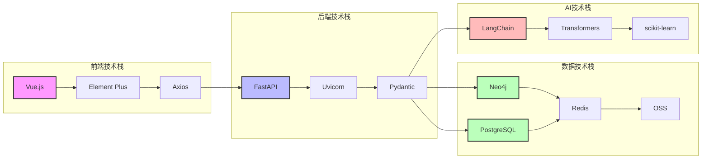
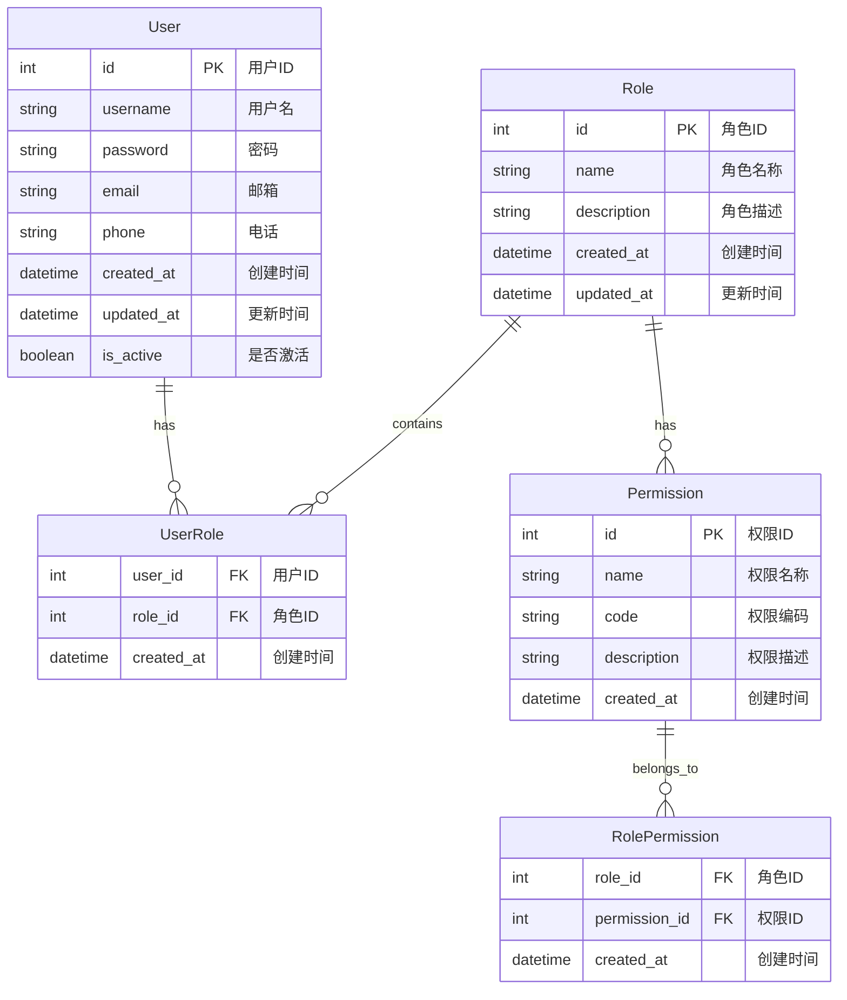
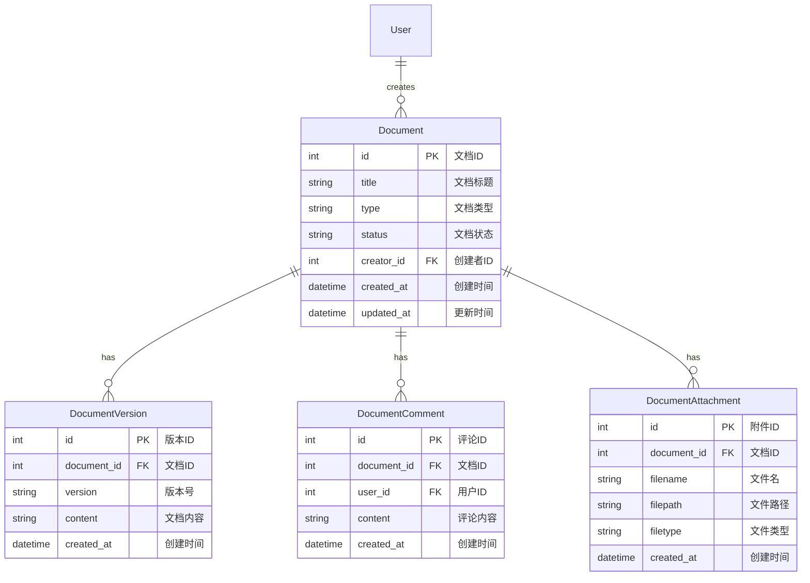

# 招标文件生成系统技术方案

## 1. 系统介绍

### 1.1 系统概述
本系统是一个基于Python和Neo4j的智能招标文件生成系统，旨在通过人工智能和知识图谱技术，实现招标文件、标书、专家评标报告、答疑函件、中标通知书等文档的自动化生成。系统集成了自然语言处理、知识图谱、模板管理等技术，提供高效、准确的文档生成服务。

### 1.2 主要功能

#### 招标文件自动生成
系统能够根据项目需求自动生成标准化的招标文件，包括招标公告、招标文件、技术规范等。通过知识图谱技术，确保生成的文件符合相关法律法规和行业标准。

#### 标书智能生成
基于招标文件要求，系统可以智能生成投标文件，包括技术方案、商务方案、资质证明等。系统会自动检查标书的完整性和合规性，确保满足招标要求。

#### 专家评标报告生成
系统能够根据评标专家的评分和意见，自动生成规范的评标报告。通过NLP技术分析专家意见，提取关键信息，生成结构化的评标结论。

#### 答疑函件生成
针对投标人的疑问，系统可以自动生成规范的答疑函件。通过知识图谱技术，确保答疑内容准确、完整，并符合相关规范。

#### 中标通知书生成
根据评标结果，系统自动生成中标通知书，包含中标单位信息、中标金额、合同签订要求等关键信息。

#### 知识图谱构建与管理
系统通过NLP技术从历史文档中提取实体和关系，构建招标领域的知识图谱。支持知识图谱的动态更新和维护，确保知识的时效性。

#### 模板管理与维护
提供可视化的模板管理界面，支持模板的创建、修改、版本控制等功能。系统内置多种标准模板，并支持自定义模板。

#### 文档预处理与解析
支持多种格式文档的导入和解析，包括Word、PDF、Excel等。通过OCR技术处理扫描文档，提取结构化信息。

## 2. 功能模块介绍

### 2.1 核心模块

#### 模块概览
| 模块名称 | 主要功能 | 技术实现 | 依赖服务 |
|---------|---------|---------|---------|
| 文档生成模块 | 基于模板生成各类文档 | Jinja2模板引擎 | 模板管理服务 |
| 知识图谱模块 | 构建和管理知识图谱 | Neo4j图数据库 | NLP服务 |
| NLP处理模块 | 文本分析和处理 | 阿里云NLP服务 | 知识图谱服务 |
| 模板管理模块 | 模板的CRUD操作 | FastAPI | 文件存储服务 |
| 文件预处理模块 | 文档格式转换和解析 | python-docx, PyPDF2 | 文件存储服务 |
| 用户管理模块 | 用户注册、登录、管理 | FastAPI + JWT | Redis |
| 权限管理模块 | 角色权限控制 | RBAC模型 | Redis |
| 文档管理模块 | 文档CRUD和预览 | FastAPI | 文件存储服务 |

#### 模块关系图


#### 模块详细说明

##### 文档生成模块
文档生成模块是系统的核心组件，负责各类文档的自动生成。该模块基于模板引擎，结合知识图谱和NLP技术，实现文档的智能生成。

##### 知识图谱模块
知识图谱模块负责构建和管理招标领域的知识网络。通过实体识别和关系抽取，将非结构化数据转化为结构化的知识图谱。

##### NLP处理模块
NLP处理模块提供文本分析能力，包括实体识别、关系抽取、文本分类等功能。该模块采用阿里云NLP服务，确保处理效果。

##### 模板管理模块
模板管理模块负责模板的存储、解析和更新。支持模板的版本控制，确保模板的规范性和可维护性。

##### 文件预处理模块
文件预处理模块负责文档的格式转换和内容提取。支持多种文档格式，确保数据的准确性和完整性。

##### 用户管理模块
用户管理模块负责系统的用户管理功能，包括用户注册、登录、信息管理等。支持个人用户和管理员用户两种角色，实现用户信息的CRUD操作。

##### 权限管理模块
权限管理模块基于RBAC（基于角色的访问控制）模型，实现细粒度的权限控制。支持角色的创建、修改、删除，以及权限的分配和回收。

##### 文档管理模块
文档管理模块提供各类文档的管理功能，包括标书、专家评估报告、答疑函件、中标通知书的CRUD操作和在线预览功能。

### 2.3 文档管理功能

#### 标书管理
标书管理模块提供全面的标书管理功能。在列表查询方面，支持多条件筛选、排序和分页功能，方便用户快速定位所需标书。文档预览功能支持在线预览和下载，确保用户可以便捷地查看标书内容。系统提供完整的CRUD操作，包括创建、读取、更新和删除标书。版本控制功能确保标书的历史版本可追溯，状态管理功能则支持草稿、待审核、已发布等多种状态的管理。

#### 专家评估报告
专家评估报告模块提供专业的报告管理功能。列表查询支持按项目、专家、时间等条件进行灵活查询。报告预览功能支持在线预览和PDF导出，方便用户查看和分享。系统提供完整的CRUD操作，支持报告的创建、编辑和删除。评分管理功能支持多维度评分，意见管理功能则帮助收集和整理专家意见。

#### 答疑函件
答疑函件模块提供高效的函件管理功能。列表查询支持按项目、时间、状态进行查询，方便用户追踪函件处理进度。函件预览功能支持在线预览和打印，确保函件内容清晰可读。系统提供完整的CRUD操作，支持函件的创建、回复和归档。流程管理功能确保函件处理流程规范，通知管理功能则自动通知相关方。

#### 中标通知书
中标通知书模块提供规范的通知书管理功能。列表查询支持按项目、中标单位进行查询，方便用户管理通知书。通知书预览功能支持在线预览和打印，确保通知书格式规范。系统提供完整的CRUD操作，支持通知书的创建、编辑和发送。模板管理功能支持多种通知书模板，发送管理功能则支持邮件、短信等多种通知方式。

## 3. 业务架构

### 3.1 系统架构图


### 3.2 技术架构

#### 整体架构
系统采用分层架构设计，包括前端层、应用层和数据层。前端层提供用户界面，应用层处理业务逻辑，数据层负责数据存储和管理。

#### 技术选型
| 层级 | 技术选型 | 说明 |
|------|---------|------|
| 前端层 | Vue.js 3.0 | 构建响应式用户界面 |
| 应用层 | Python FastAPI | 提供高性能API服务 |
| 数据层 | Neo4j 5.18.0 | 图数据库，存储知识图谱 |
| 数据层 | PostgreSQL 15.0 | 关系型数据库，存储业务数据 |
| 存储层 | 阿里云OSS | 对象存储服务 |
| AI服务 | 阿里云NLP | 提供NLP能力 |

#### 技术架构图


## 4. 数据模型

### 4.1 知识图谱模型

#### 实体关系图


#### 字段说明表
| 实体/关系 | 字段名 | 类型 | 业务含义 | 示例值 |
|-----------|--------|------|----------|--------|
| Entity | id | string | 实体唯一标识 | "E001" |
| Entity | name | string | 实体名称 | "招标项目" |
| Entity | type | string | 实体类型 | "Project" |
| Entity | properties | string | 实体属性 | {"budget": "100万"} |
| Relation | id | string | 关系唯一标识 | "R001" |
| Relation | type | string | 关系类型 | "BELONGS_TO" |
| Relation | source | string | 源实体ID | "E001" |
| Relation | target | string | 目标实体ID | "E002" |
| Document | id | string | 文档唯一标识 | "D001" |
| Document | type | string | 文档类型 | "Bidding" |
| Document | content | string | 文档内容 | "招标文件正文" |
| Document | metadata | string | 文档元数据 | {"createTime": "2024-03-20"} |

### 4.2 关系型数据模型

#### 用户与权限模型


#### 文档管理模型


#### 字段说明表
| 实体 | 字段名 | 类型 | 业务含义 | 示例值 |
|------|--------|------|----------|--------|
| User | id | int | 用户ID | 1 |
| User | username | string | 用户名 | "admin" |
| User | password | string | 密码 | "hashed_password" |
| User | email | string | 邮箱 | "admin@example.com" |
| Role | id | int | 角色ID | 1 |
| Role | name | string | 角色名称 | "管理员" |
| Role | description | string | 角色描述 | "系统管理员" |
| Permission | id | int | 权限ID | 1 |
| Permission | name | string | 权限名称 | "查看用户" |
| Permission | code | string | 权限编码 | "user:view" |
| Document | id | int | 文档ID | 1 |
| Document | title | string | 文档标题 | "招标文件" |
| Document | type | string | 文档类型 | "bidding" |
| Document | status | string | 文档状态 | "draft" |
| DocumentVersion | id | int | 版本ID | 1 |
| DocumentVersion | version | string | 版本号 | "1.0.0" |
| DocumentVersion | content | string | 文档内容 | "文档正文" |

### 4.3 数据存储策略

#### 数据分布
系统采用多级存储架构，不同类型的数据存储在不同的存储系统中。知识图谱数据存储在Neo4j中，用于存储实体关系和知识网络。用户权限数据存储在PostgreSQL中，用于存储用户、角色、权限等基础数据。文档元数据也存储在PostgreSQL中，用于存储文档基本信息、版本信息等。文档实际内容存储在阿里云OSS中，确保大文件的高效存储和访问。缓存数据存储在Redis中，用于存储会话、临时数据等。

#### 数据同步策略
系统采用多层次的同步策略，确保数据的一致性和实时性。实时同步策略应用于用户权限变更、文档状态更新、评论和附件操作等需要即时响应的场景。定时同步策略用于处理文档统计信息、用户行为分析、系统性能指标等周期性数据。异步同步策略则适用于文档内容更新、批量数据处理、日志记录等对实时性要求不高的场景。

## 5. 业务流程

### 5.1 招标文件生成流程


### 5.2 标书生成流程


## 6. 技术选型

### 6.1 核心技术

#### 技术栈概览
| 类别 | 技术 | 版本 | 用途 | 说明 |
|------|------|------|------|------|
| 编程语言 | Python | 3.8+ | 后端开发 | 主要开发语言 |
| 数据库 | Neo4j | 5.18.0 | 图数据库 | 存储知识图谱 |
| AI框架 | LangChain | 0.3.23 | AI应用开发 | 构建AI应用 |
| AI框架 | Transformers | 4.51.2 | 模型加载 | 加载预训练模型 |
| AI框架 | scikit-learn | 1.6.1 | 机器学习 | 模型训练和评估 |
| 文档处理 | python-docx | 1.1.2 | Word文档处理 | 生成Word文档 |
| 文档处理 | PyPDF2 | 3.0.1 | PDF文档处理 | 处理PDF文档 |
| 文档处理 | tabula-py | 2.10.0 | 表格提取 | 从PDF提取表格 |
| NLP服务 | 阿里云NLP | 最新版 | 自然语言处理 | 提供NLP能力 |
| NLP工具 | NLTK | 3.9.1 | 文本处理 | 基础文本处理 |
| NLP工具 | CRF Suite | 0.5.0 | 序列标注 | 实体识别 |

### 6.2 开发工具
| 工具 | 版本 | 用途 | 说明 |
|------|------|------|------|
| Git | 2.x | 版本控制 | 代码版本管理 |
| Docker | 24.x | 容器化 | 应用容器化部署 |
| pip | 23.x | 依赖管理 | Python包管理 |
| python-dotenv | 1.0.0 | 环境管理 | 环境变量管理 |

## 7. 接口文档

### 7.1 统一请求结构
```json
{
    "code": 200,
    "message": "success",
    "data": {
        // 具体业务数据
    }
}
```

### 7.2 统一响应结构
```json
{
    "code": 200,
    "message": "success",
    "data": {
        // 具体业务数据
    }
}
```

### 7.3 文档生成接口

#### 生成招标文件
- **接口说明**：根据项目信息生成招标文件
- **请求路径**：`POST /api/v1/documents/bidding`
- **请求参数**：
```json
{
    "template_id": "string", // 模板ID，必填
    "project_info": {
        "name": "string", // 项目名称，必填
        "type": "string", // 项目类型，必填
        "requirements": "string" // 项目要求，必填
    },
    "parameters": {
        "key": "value" // 其他参数，选填
    }
}
```
- **响应参数**：
```json
{
    "code": 200,
    "message": "success",
    "data": {
        "document_id": "string", // 生成的文档ID
        "document_url": "string", // 文档下载地址
        "create_time": "string" // 创建时间
    }
}
```

#### 生成标书
- **接口说明**：根据招标文件生成标书
- **请求路径**：`POST /api/v1/documents/proposal`
- **请求参数**：
```json
{
    "template_id": "string", // 模板ID，必填
    "bidder_info": {
        "name": "string", // 投标人名称，必填
        "qualification": "string" // 资质信息，必填
    },
    "project_id": "string", // 项目ID，必填
    "parameters": {
        "key": "value" // 其他参数，选填
    }
}
```
- **响应参数**：
```json
{
    "code": 200,
    "message": "success",
    "data": {
        "document_id": "string", // 生成的文档ID
        "document_url": "string", // 文档下载地址
        "create_time": "string" // 创建时间
    }
}
```

### 7.4 知识图谱接口

#### 查询实体
- **接口说明**：根据实体ID查询实体信息
- **请求路径**：`GET /api/v1/knowledge/entity/{entity_id}`
- **请求参数**：
  - entity_id: 实体ID，路径参数
- **响应参数**：
```json
{
    "code": 200,
    "message": "success",
    "data": {
        "id": "string", // 实体ID
        "name": "string", // 实体名称
        "type": "string", // 实体类型
        "properties": {} // 实体属性
    }
}
```

#### 添加关系
- **接口说明**：添加实体间的关系
- **请求路径**：`POST /api/v1/knowledge/relation`
- **请求参数**：
```json
{
    "source_id": "string", // 源实体ID，必填
    "target_id": "string", // 目标实体ID，必填
    "relation_type": "string", // 关系类型，必填
    "properties": {
        "key": "value" // 关系属性，选填
    }
}
```
- **响应参数**：
```json
{
    "code": 200,
    "message": "success",
    "data": {
        "relation_id": "string", // 关系ID
        "create_time": "string" // 创建时间
    }
}
```

### 7.5 模板管理接口

#### 获取模板
- **接口说明**：根据模板ID获取模板信息
- **请求路径**：`GET /api/v1/templates/{template_id}`
- **请求参数**：
  - template_id: 模板ID，路径参数
- **响应参数**：
```json
{
    "code": 200,
    "message": "success",
    "data": {
        "id": "string", // 模板ID
        "name": "string", // 模板名称
        "content": "string", // 模板内容
        "sections": [] // 模板章节
    }
}
```

#### 更新模板
- **接口说明**：更新模板信息
- **请求路径**：`PUT /api/v1/templates/{template_id}`
- **请求参数**：
```json
{
    "name": "string", // 模板名称，必填
    "content": "string", // 模板内容，必填
    "sections": [
        {
            "name": "string", // 章节名称，必填
            "content": "string" // 章节内容，必填
        }
    ]
}
```
- **响应参数**：
```json
{
    "code": 200,
    "message": "success",
    "data": {
        "template_id": "string", // 模板ID
        "update_time": "string" // 更新时间
    }
}
```

## 8. 部署方案

### 8.1 环境要求
| 类别 | 要求 | 说明 |
|------|------|------|
| 操作系统 | Linux/Windows | 支持主流操作系统 |
| Python版本 | 3.8+ | 需要Python 3.8或更高版本 |
| 数据库 | Neo4j 5.18.0 | 需要Neo4j图数据库 |
| 容器化 | Docker 24.x | 需要Docker环境 |
| 云服务 | 阿里云账号 | 用于NLP服务和对象存储 |

### 8.2 部署架构


### 8.3 部署步骤
系统部署采用标准化的流程，确保部署过程的可控性和可重复性。环境准备阶段需要安装Docker和Docker Compose，配置Neo4j数据库，以及配置阿里云服务。应用部署阶段包括构建Docker镜像，配置环境变量，以及启动应用服务。服务配置阶段需要配置负载均衡，配置数据库连接，以及配置缓存服务。监控配置阶段则包括配置日志收集，配置性能监控，以及配置告警规则。

## 9. 前端设计

### 9.1 技术栈选型
| 类别 | 技术 | 版本 | 说明 |
|------|------|------|------|
| 前端框架 | Vue.js | 3.3.0 | 核心框架 |
| 构建工具 | Vite | 4.5.0 | 开发构建工具 |
| UI框架 | Element Plus | 2.4.0 | 组件库 |
| 状态管理 | Pinia | 2.1.0 | 状态管理 |
| 路由管理 | Vue Router | 4.2.0 | 路由管理 |
| HTTP客户端 | Axios | 1.6.0 | 网络请求 |
| 工具库 | Lodash | 4.17.21 | 工具函数库 |
| 图表库 | ECharts | 5.4.0 | 数据可视化 |
| 富文本编辑器 | TinyMCE | 6.7.0 | 文档编辑 |
| PDF预览 | PDF.js | 3.11.0 | PDF在线预览 |

### 9.2 项目结构
```
src/
├── api/                # API接口
├── assets/            # 静态资源
├── components/        # 公共组件
├── composables/       # 组合式函数
├── layouts/           # 布局组件
├── router/            # 路由配置
├── stores/            # 状态管理
├── styles/            # 样式文件
├── utils/             # 工具函数
└── views/             # 页面组件
```

### 9.3 页面设计

#### 布局设计


#### 主要页面
1. **登录页面**
   - 账号密码登录
   - 验证码校验
   - 记住密码功能

2. **首页仪表盘**
   - 数据统计概览
   - 待办事项
   - 最近文档
   - 系统公告

3. **文档管理页面**
   - 文档列表
   - 高级搜索
   - 批量操作
   - 文档预览

4. **用户管理页面**
   - 用户列表
   - 角色管理
   - 权限配置
   - 操作日志

5. **系统设置页面**
   - 基础配置
   - 模板管理
   - 系统日志
   - 数据备份

### 9.4 组件设计

#### 公共组件
| 组件名称 | 功能描述 | 使用场景 |
|----------|----------|----------|
| SearchForm | 高级搜索表单 | 列表页面搜索 |
| DataTable | 数据表格 | 数据列表展示 |
| FileUpload | 文件上传 | 文档上传 |
| RichEditor | 富文本编辑器 | 文档编辑 |
| PDFViewer | PDF预览 | 文档预览 |
| StatusTag | 状态标签 | 状态展示 |
| ConfirmDialog | 确认对话框 | 操作确认 |

#### 业务组件
| 组件名称 | 功能描述 | 使用场景 |
|----------|----------|----------|
| DocumentList | 文档列表 | 文档管理 |
| UserForm | 用户表单 | 用户管理 |
| RoleSelect | 角色选择 | 权限管理 |
| TemplateEditor | 模板编辑器 | 模板管理 |
| WorkflowChart | 流程图 | 流程管理 |

### 9.5 状态管理

#### Pinia Store设计
```typescript
// 用户状态
interface UserState {
  userInfo: UserInfo;
  permissions: string[];
  roles: string[];
}

// 文档状态
interface DocumentState {
  documentList: Document[];
  currentDocument: Document;
  filters: DocumentFilter;
}

// 系统状态
interface SystemState {
  settings: SystemSettings;
  notifications: Notification[];
}
```

### 9.6 路由设计
```typescript
const routes = [
  {
    path: '/',
    component: Layout,
    children: [
      {
        path: 'dashboard',
        component: Dashboard,
        meta: { title: '首页', icon: 'dashboard' }
      },
      {
        path: 'documents',
        component: DocumentLayout,
        meta: { title: '文档管理', icon: 'document' },
        children: [
          {
            path: 'bidding',
            component: BiddingList,
            meta: { title: '标书管理' }
          },
          {
            path: 'report',
            component: ReportList,
            meta: { title: '评估报告' }
          }
        ]
      }
    ]
  }
]
```

### 9.7 接口设计

#### 统一请求配置
```typescript
// axios配置
const service = axios.create({
  baseURL: import.meta.env.VITE_API_URL,
  timeout: 15000,
  headers: {
    'Content-Type': 'application/json'
  }
})

// 请求拦截器
service.interceptors.request.use(
  config => {
    const token = getToken()
    if (token) {
      config.headers['Authorization'] = `Bearer ${token}`
    }
    return config
  },
  error => {
    return Promise.reject(error)
  }
)
```

#### 接口模块化
```typescript
// 用户相关接口
export const userApi = {
  login: (data: LoginData) => request.post('/auth/login', data),
  getUserInfo: () => request.get('/user/info'),
  updateUser: (data: UserData) => request.put('/user', data)
}

// 文档相关接口
export const documentApi = {
  getList: (params: QueryParams) => request.get('/documents', { params }),
  getDetail: (id: string) => request.get(`/documents/${id}`),
  create: (data: DocumentData) => request.post('/documents', data),
  update: (id: string, data: DocumentData) => request.put(`/documents/${id}`, data),
  delete: (id: string) => request.delete(`/documents/${id}`)
}
```

### 9.8 权限控制

#### 路由权限
```typescript
// 路由守卫
router.beforeEach(async (to, from, next) => {
  const token = getToken()
  if (token) {
    if (to.path === '/login') {
      next({ path: '/' })
    } else {
      const hasRoles = store.getters.roles && store.getters.roles.length > 0
      if (hasRoles) {
        next()
      } else {
        try {
          const { roles } = await store.dispatch('user/getInfo')
          const accessRoutes = await store.dispatch('permission/generateRoutes', roles)
          router.addRoutes(accessRoutes)
          next({ ...to, replace: true })
        } catch (error) {
          await store.dispatch('user/resetToken')
          next(`/login?redirect=${to.path}`)
        }
      }
    }
  } else {
    if (whiteList.indexOf(to.path) !== -1) {
      next()
    } else {
      next(`/login?redirect=${to.path}`)
    }
  }
})
```

#### 按钮权限
```typescript
// 权限指令
const permission = {
  mounted(el: HTMLElement, binding: DirectiveBinding) {
    const { value } = binding
    const roles = store.getters.roles
    if (value && value instanceof Array && value.length > 0) {
      const hasPermission = roles.some(role => {
        return value.includes(role)
      })
      if (!hasPermission) {
        el.parentNode && el.parentNode.removeChild(el)
      }
    }
  }
}
```

